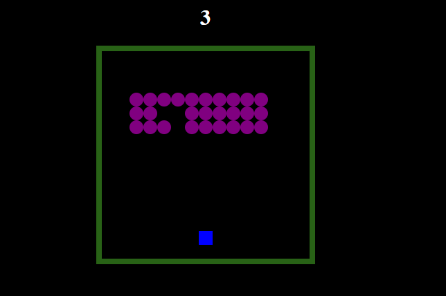

# Space Invader Game:

The following space Invader is the re-implementation of space Invader by Japanese video game company Taito. 
Space Invaders is a fixed shooter in which the player moves a laser cannon horizontally across the bottom of the screen and fires at aliens overhead.
The space Invader game build in 1978 by Tomohiro Nishikado.

# Tech Stack :
 
HTML, CSS, JS

# features Implemented : 

1. The moving canon and the moving invaders.
2. The moving shooting lasers.
3. Checking the either the player has been won or loose and keeping the track of player highest score.

# How to play : 

In the game, the purple ball are the invaders iinvading through the space that want to take over Our world.
And the you our Hero have to save Our precious planet from the invasion and kill all the invaders by the Green canon provided to you.

## Working of Canon : 
 
 The canon moves in x axis either left or right and the Hero have to target the Invader's one by one and Kill all of them.
 
 # Win or Lose condition: 
 
 If the Player will be able to kill all the Invader, our Hero will win and Planet will be saved.
 
 Else The player will lose and Invaders will invade the planet
   

Link : https://jsspaceinvader.netlify.app/

